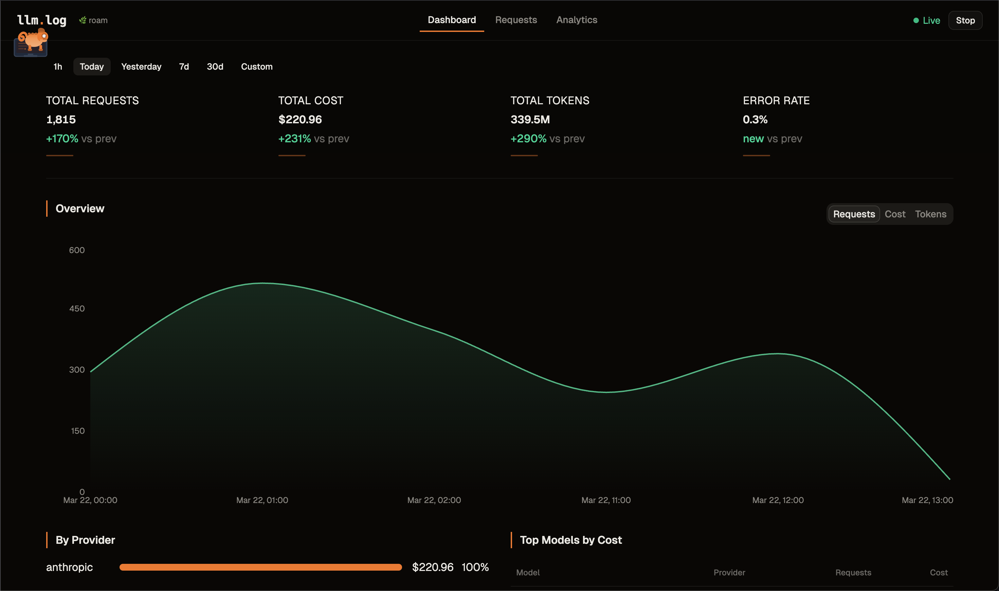
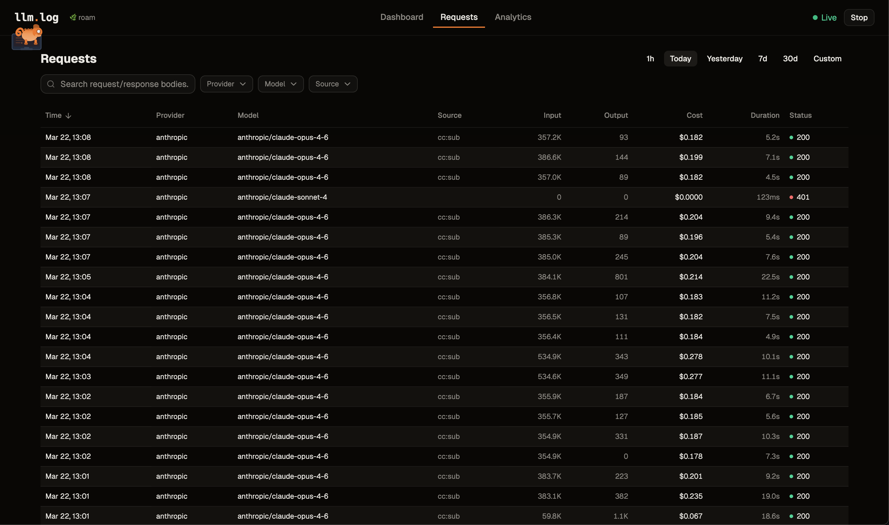
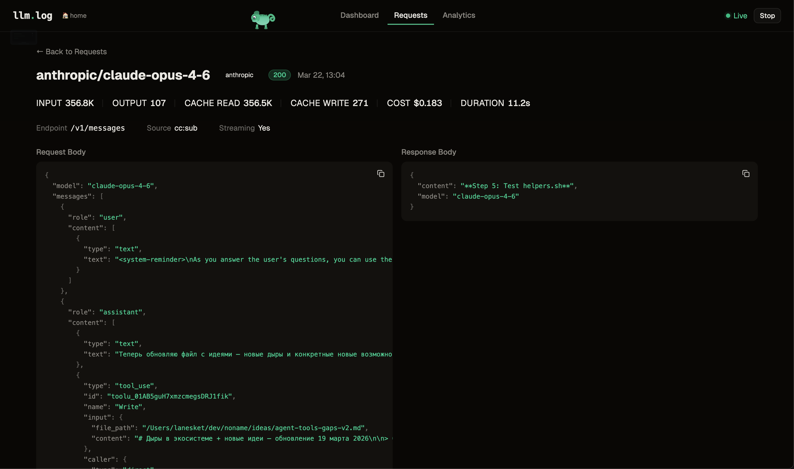
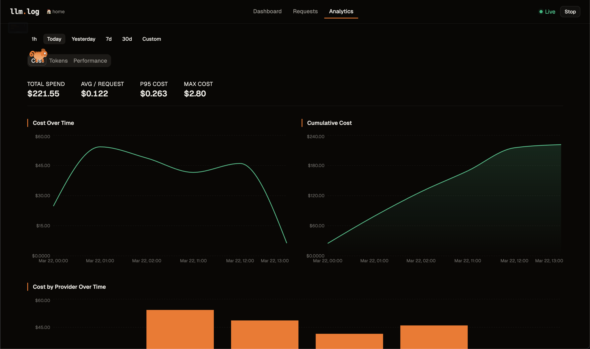
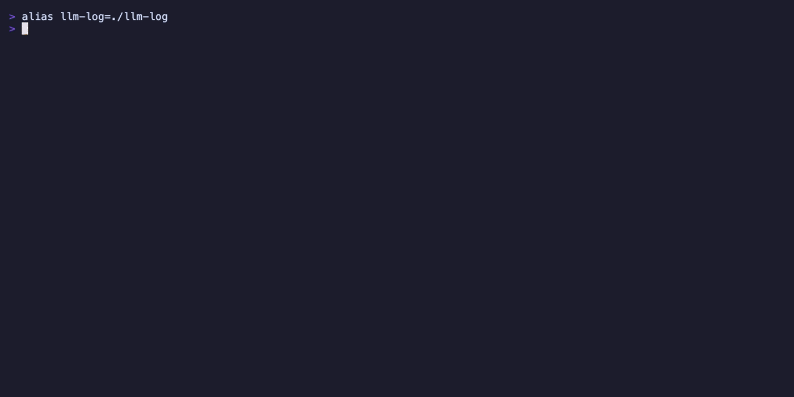

<p align="center">
  <h1 align="center">llm.log</h1>
  <p align="center">Track tokens, costs, and every prompt across all your LLM APIs.<br>Runs locally. Web + TUI dashboard, single binary, zero config.</p>
</p>

<p align="center">
  <a href="#install">Install</a> · <a href="#quick-start">Quick Start</a> · <a href="#dashboard">Dashboard</a> · <a href="#cli">CLI</a> · <a href="#export">Export</a> · <a href="#data-management">Data Management</a> · <a href="#how-it-works">How it Works</a>
</p>

<p align="center">
  <a href="https://github.com/lanesket/llm.log/actions/workflows/build.yml"></a>&nbsp;
  <a href="https://github.com/lanesket/llm.log/releases/latest"></a>&nbsp;
  <a href="https://goreportcard.com/report/github.com/lanesket/llm.log"></a>&nbsp;
  &nbsp;
  <a href="https://github.com/lanesket/llm.log/blob/main/LICENSE"></a>
</p>

---

<table>
  <tr>
    <td></td>
    <td></td>
  </tr>
  <tr>
    <td></td>
    <td></td>
  </tr>
</table>

<p align="center">
  <sub>Web UI — <code>llm-log ui</code></sub>
</p>

<p align="center">
  <br>
  <sub>TUI — <code>llm-log dash</code></sub>
</p>

## What is llm.log?

A local proxy that sits between your apps and LLM APIs. It intercepts requests, extracts token usage, calculates costs, and stores everything in SQLite — without changing a single line of code.

- **Zero code changes** — works via `HTTPS_PROXY`, picked up by most apps automatically
- **All major providers** — OpenAI, Anthropic, OpenRouter, Groq, DeepSeek, Mistral, and [more](#providers-and-formats)
- **All API formats** — Chat Completions, Responses API, Anthropic Messages
- **Real costs** — auto-updated pricing for 800+ models, cache token breakdowns
- **Claude Code aware** — on a subscription? see what you'd pay without it. On API keys? see your actual spend
- **Web UI** — browser-based dashboard with real-time charts, analytics, and detailed request inspection
- **TUI dashboard** — terminal-based overview, charts, cost breakdown, request inspector
- **Minimal overhead** — logging is async and never blocks your requests
- **Single binary** — pure Go, no CGO, no dependencies

## Install

```bash
# macOS / Linux (Homebrew)
brew install lanesket/tap/llm-log

# or with Go
go install github.com/lanesket/llm.log/cmd/llm-log@latest

# or from source
git clone https://github.com/lanesket/llm.log.git && cd llm.log && make build
```

Pre-built binaries for macOS and Linux on the [Releases](https://github.com/lanesket/llm.log/releases) page.

## Quick Start

```bash
llm-log setup   # one-time: generate CA cert, trust it, configure shell
llm-log start   # start the proxy
llm-log dash    # open the dashboard
```

After setup, **open a new terminal** (or run `source ~/.zshrc`) — then every LLM API call is logged automatically.

> **Already running apps need a restart** to pick up the proxy.
> On macOS, new apps from Dock pick it up automatically.

> **Note:** llm.log intercepts requests that go directly from your machine to LLM APIs.
> Tools that route through their own servers (Cursor Pro, VS Code Copilot with built-in subscription) won't be logged.
> If the tool supports your own API key, requests go directly to the provider and llm.log captures them.

## Web UI

```bash
llm-log ui   # opens http://localhost:9923
```

| Page | What it shows |
|------|---------------|
| **Dashboard** | Real-time metrics (animated), area charts (requests/cost/tokens), provider breakdown, top models |
| **Requests** | Paginated table with sorting, filters, search. Click a row to see full detail with copyable values |
| **Analytics** | Tabbed sections — Cost (over time, cumulative, by provider, distribution, top expensive), Tokens (over time, avg/model, cache hit rate), Performance (latency, heatmap) |

## TUI Dashboard

```bash
llm-log dashboard   # or: llm-log dash
```

| Tab | What it shows |
|-----|---------------|
| **Overview** | Total spend, request count, cache hit rate, contribution heatmap, top models |
| **Chart** | Cumulative cost, requests, tokens, cache hit rate over time |
| **Cost** | Breakdown by provider/model with percentages, latency, bars |
| **Requests** | Browse requests, inspect full prompt/response JSON |

**Keys:** `1-4` tabs · `p` period · `s` source · `f` provider · `m` model/provider · `j/k` navigate · `enter` detail · `c/p/r` copy · `e` export · `?` help · `q` quit

## CLI

```bash
llm-log status                    # daemon status + today's summary
llm-log logs                      # recent requests
llm-log logs --id 42              # full detail with prompt/response
llm-log logs -s cc:sub            # filter by source
llm-log stats                     # usage stats by provider
llm-log stats -b model -p week   # by model, last week
llm-log stats --json              # JSON output
```

## Export

Export logged data to CSV, JSON, or JSONL for analysis in Excel, Jupyter, pandas, etc.

```bash
llm-log export                            # CSV to stdout (last month)
llm-log export -f json -o data.json       # JSON to file
llm-log export -f jsonl -p week           # JSONL, last week
llm-log export --from 2025-03-01 --to 2025-03-15  # date range
llm-log export -s cc:sub --provider anthropic      # filtered
llm-log export --with-bodies -p today     # include request/response bodies
```

| Flag | Description | Default |
|------|-------------|---------|
| `-f, --format` | Output format: `csv`, `json`, `jsonl` | `csv` |
| `-p, --period` | Period: `today`, `week`, `month`, `all` | `month` |
| `--from` | Start date (`YYYY-MM-DD`) | — |
| `--to` | End date (`YYYY-MM-DD`) | — |
| `-s, --source` | Filter by source | all |
| `--provider` | Filter by provider | all |
| `-o, --output` | Output file (default: stdout) | stdout |
| `--with-bodies` | Include request/response bodies | `false` |

`--from`/`--to` override `--period` when both are provided.

In the dashboard, press `e` to quick-export the current filtered view to `llm-log-export-{timestamp}.csv` in the current directory.

## Data Management

Request/response bodies can grow large over time. Use `prune` to delete old bodies while keeping all metadata (tokens, costs, timestamps).

```bash
llm-log prune --older-than 30d              # delete bodies older than 30 days
llm-log prune --older-than 30d --dry-run    # preview without deleting
llm-log prune --older-than 6m --force       # skip confirmation (for cron)
```

Supported durations: `7d`, `30d`, `6m`, `1y`.

## How it Works

```
Your app ──HTTPS_PROXY──▸ llm.log (127.0.0.1:9922)
                              │
                              ├─ LLM provider? ──▸ MITM ──▸ parse usage ──▸ SQLite
                              └─ Other?         ──▸ tunnel through (no interception)
```

1. `llm-log setup` generates a CA certificate and adds it to your system trust store
2. `llm-log start` launches a daemon and sets `HTTPS_PROXY` + CA env vars for all major tools
3. The proxy MITMs only known LLM domains — everything else tunnels untouched
4. Streaming responses are tee'd — client gets data in real-time, proxy parses accumulated result
5. Costs are calculated from auto-updated pricing data (780+ models)

### Providers and formats

| Provider | Domain | API formats |
|----------|--------|-------------|
| OpenAI | api.openai.com | Chat Completions, Responses API |
| Anthropic | api.anthropic.com | Anthropic Messages |
| OpenRouter | openrouter.ai | All three |
| Groq | api.groq.com | Chat Completions |
| Together AI | api.together.xyz | Chat Completions |
| Fireworks | api.fireworks.ai | Chat Completions |
| DeepSeek | api.deepseek.com | Chat Completions (custom cache tokens) |
| Mistral | api.mistral.ai | Chat Completions |
| Perplexity | api.perplexity.ai | Sonar, Chat Completions |
| xAI | api.x.ai | Chat Completions |

Providers and wire formats are extensible — see [Extending llm.log](docs/extending.md).

### Proxy activation

| Mechanism | Scope | Platform |
|-----------|-------|----------|
| `~/.llm.log/env` | New terminal sessions | macOS, Linux |
| `launchctl setenv` | GUI apps from Dock | macOS |
| `systemctl --user` | GUI apps from menu | Linux (systemd) |

CA trust is configured for Node.js, Python, curl, Go, and Ruby via `NODE_EXTRA_CA_CERTS`, `SSL_CERT_FILE`, `REQUESTS_CA_BUNDLE`, and `CURL_CA_BUNDLE`.

### Data storage

Everything in `~/.llm.log/` — SQLite (WAL mode), CA cert, cached pricing, env file, PID. Request/response bodies are gzip-compressed in a separate table.

## License

MIT
